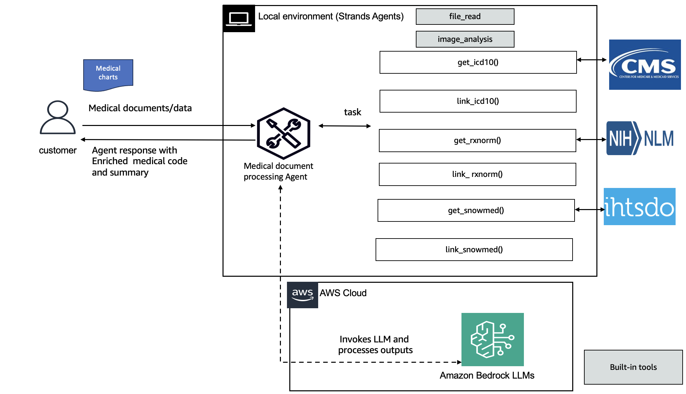

# Medical Document Processing Assistant

## Overview

The Medical Document Processing Assistant is an AI-powered tool designed to extract, analyze, and enrich medical information from various document formats such as PDFs and images. This assistant specializes in processing clinical notes, pathology reports, discharge summaries, and other medical documents to provide structured data with standardized medical coding.



1/ Extract text from PDF medical documents

2/ Infer key medical information (diagnosis, medications, treatments)

3/ Enrich the data with standardized medical codes (ICD-10, RxNorm, SNOMED CT)

## Key Features

### 1. Document Processing 📄
- Extracts text from PDFs and images using OCR capabilities
- Processes various medical document formats
- Converts unstructured text into structured JSON format

### 2. Medical Information Extraction 🔍
- Identifies key medical entities:
  - Diagnoses
  - Medications
  - Treatments
  - Patient information
  - Vital signs

### 3. Medical Coding Enrichment 🏥
- Enriches extracted information with standardized medical codes:
  - ICD-10 codes for diagnoses
  - RxNorm codes for medications
  - SNOMED CT codes for treatments and procedures

### 4. Comprehensive Report Generation 📊
- Creates detailed summaries of patient information
- Provides structured data for electronic health record (EHR) integration
- Generates human-readable reports for healthcare providers

## Getting Started

1. Install [uv](https://docs.astral.sh/uv/getting-started/installation/).

2. Set up AWS credentials in `.env` using [.env.example](./.env.example).

3. Install required dependencies:
   ```bash
   uv pip install -r requirements.txt
   ```

4. Run the Medical Document Processing Assistant:
   ```bash
   uv run main.py
   ```
5. Select one of the three options as follows: 


* Option 1:   You can enter your medical text input for the medical agent. 

For example:

```
Carlie had a seizure 2 weeks ago. She is complaining of frequent headaches
Nausea is also present. She also complains of eye trouble with blurry vision
Meds : Topamax 50 mgs at breakfast daily,
Send referral order to neurologist
Follow-up as scheduled
```
And produce enriched structured data with:
- Diagnosis (with ICD-10 codes)
- Medications (with RxNorm codes)
- Treatments (with SNOMED CT codes)

* Option 2 is to pass the path to the document like patient summary report. 

* Option 3 is to run with some sample text data.

## Use Cases

- **Clinical Documentation**: Streamline the process of converting handwritten or scanned notes into structured data
- **Medical Coding Assistance**: Help medical coders quickly identify and assign appropriate codes
- **Research Data Collection**: Extract and standardize medical information for research purposes
- **EHR Integration**: Prepare unstructured medical documents for integration with electronic health record systems

## Determining ICD-10, SNOMED, RxNorm

We will be using the existing tools and API to get details about entity linking. 

Note:
1. ICD-10-CM & ICD-10-PCS (U.S. Versions)
Official Source: U.S. Centers for Medicare & Medicaid Services (CMS) and the National Center for Health Statistics (NCHS)

ICD-10-CM (diagnoses):

Call API: https://clinicaltables.nlm.nih.gov/apidoc/icd10cm/v3/doc.html


ICD-10-PCS (procedures):

📍 https://www.cms.gov/medicare/icd-10/2025-icd-10-pcs
(Adjust year as needed)

2. RxNorm
Official Source: U.S. National Library of Medicine (NLM)
https://lhncbc.nlm.nih.gov/RxNav/APIs/RxNormAPIs.html?_gl=1*1qdlo6u*_ga*ODQ1ODkzMzMyLjE3NDg4MzYwMjc.*_ga_7147EPK006*czE3NDg4MzYwMjYkbzEkZzEkdDE3NDg4MzY2MDAkajYwJGwwJGgw*_ga_P1FPTH9PL4*czE3NDg4MzYwMjYkbzEkZzEkdDE3NDg4MzY2MDAkajYwJGwwJGgw

3. SNOMED CT
International Edition

Official Source: SNOMED 

📍 https://browser.ihtsdotools.org/?perspective=full&conceptId1=404684003&edition=MAIN/SNOMEDCT-US/2025-03-01&release=&languages=en

