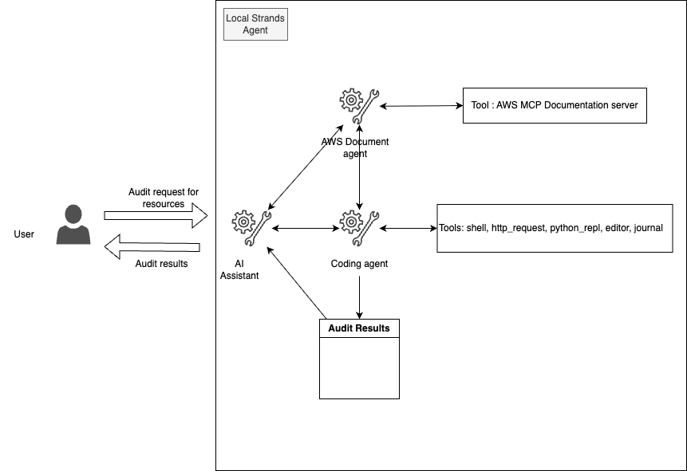

# AWS Audit Assistant: Automated Resource Compliance Checker

## ⚠️ Important Security Notice
This tool executes scripts that may affect your AWS environment. **Always run it from a sandbox environment with read-only permissions**. A Terraform script is provided in the `sandbox` folder to create an EC2 instance with the appropriate read-only IAM role for safe auditing.

## 🎯 Overview
AWS Audit Assistant is your AI-powered partner for ensuring AWS resource compliance with best practices. It provides intelligent insights and recommendations for security and efficiency improvements.   



## 🏗️ Architecture

### Components
- **Multi-Agent System**: Coordinated agents working together for comprehensive auditing
- **Documentation Retriever**: Fetches and analyzes AWS best practices documentation
- **Boto3 Code Assistant**: Generates and executes AWS API calls safely
- **Resource Auditor**: Evaluates resources against compliance standards

### Technical Stack
| Component | Description |
|-----------|-------------|
| Model Provider | Amazon Bedrock (Claude 3.5 Sonnet) |
| Native Tools | boto3, file_read, shell, python_repl |
| Custom Agents | Documentation Retriever, Boto3 Code Assistant, Resource Auditor |

## 📋 Prerequisites

1. AWS Account with appropriate permissions
   - [Create an AWS Account](https://aws.amazon.com/premiumsupport/knowledge-center/create-and-activate-aws-account/)
   - [Understanding AWS IAM](https://docs.aws.amazon.com/IAM/latest/UserGuide/introduction.html)
   - [AWS CLI Configuration Guide](https://docs.aws.amazon.com/cli/latest/userguide/cli-configure-quickstart.html)
   
   Required Permissions:
   - Create EC2 instances
   - Create IAM roles
   - Create Security Groups
   
   Additional Resources:
   - [Understanding EC2 Permissions](https://docs.aws.amazon.com/AWSEC2/latest/UserGuide/iam-policies-for-amazon-ec2.html)
   - [IAM Roles Overview](https://docs.aws.amazon.com/IAM/latest/UserGuide/id_roles.html)
   - [Security Groups Guide](https://docs.aws.amazon.com/vpc/latest/userguide/VPC_SecurityGroups.html)

2. Python 3.11 or higher
   - [Download Python](https://www.python.org/downloads/)
   - [Python Installation Guide](https://docs.python.org/3/using/index.html)

3. [uv package manager](https://docs.astral.sh/uv/getting-started/installation/)
   - Installation guides for different platforms:
     - [Linux/macOS Installation](https://docs.astral.sh/uv/installation/#linux-and-macos)
     - [Windows Installation](https://docs.astral.sh/uv/installation/#windows)

4. AWS credentials configured locally or appropriate IAM role
   - [Configuring AWS Credentials](https://docs.aws.amazon.com/cli/latest/userguide/cli-configure-files.html)
   - [IAM Roles Guide](https://docs.aws.amazon.com/IAM/latest/UserGuide/id_roles.html)
   - [AWS CLI Installation](https://docs.aws.amazon.com/cli/latest/userguide/getting-started-install.html)

5. Terraform (for sandbox environment)
   - [Install Terraform](https://developer.hashicorp.com/terraform/tutorials/aws-get-started/install-cli)
   - [Terraform AWS Provider Setup](https://registry.terraform.io/providers/hashicorp/aws/latest/docs#authentication-and-configuration)
   - [Terraform Basic Commands](https://developer.hashicorp.com/terraform/tutorials/aws-get-started/aws-build)

## 🚀 Installation & Setup

### Option 1: Local Installation (Development Only)

⚠️ **IMPORTANT**: This option is strictly for development and testing purposes only. DO NOT use this installation method in any production environment as it may not have the necessary security controls and could potentially impact your AWS resources. For production use, always use Option 2 (Sandbox Environment) which provides proper isolation and read-only permissions.

```bash
# Install dependencies using uv
uv pip install -r requirements.txt

# Run the assistant
uv run ai_assistant.py
```

### Option 2: Sandbox Environment (Recommended)

The sandbox environment provides a secure way to run the AWS Audit Assistant with appropriate read-only permissions. It includes Terraform configurations to create an EC2 instance with the necessary IAM roles and security settings.

#### 1. Deploy Infrastructure
```bash
# Navigate to sandbox directory
cd sandbox

# Initialize Terraform
terraform init

# Review the deployment plan
terraform plan

# Deploy the resources
terraform apply
```

Learn more:
- [Terraform AWS Provider](https://registry.terraform.io/providers/hashicorp/aws/latest/docs)
- [EC2 Instance Types](https://aws.amazon.com/ec2/instance-types/)

#### 2. Copy Required Files
After the infrastructure is deployed, copy the necessary files to the EC2 instance:

```bash
scp -i ./audit-assistant-key.pem \
    ../ai_assistant.py \
    ../aws_document_agent.py \
    ../strands_boto_agent.py \
    ../requirements.txt \
    ec2-user@<instance-public-ip>:/home/ec2-user/
```

Learn more:
- [Using SCP with EC2](https://docs.aws.amazon.com/AWSEC2/latest/UserGuide/AccessingInstancesLinux.html#AccessingInstancesLinuxSCP)
- [EC2 Key Pairs](https://docs.aws.amazon.com/AWSEC2/latest/UserGuide/ec2-key-pairs.html)

#### 3. Install Dependencies
SSH into the EC2 instance and install the required packages:

```bash
# Connect to the instance
ssh -i ./audit-assistant-key.pem ec2-user@<instance-public-ip>

# Install dependencies
pip3 install -r requirements.txt
```

Learn more:
- [Connecting to EC2 Instances](https://docs.aws.amazon.com/AWSEC2/latest/UserGuide/AccessingInstances.html)
- [Python Package Installation](https://packaging.python.org/en/latest/tutorials/installing-packages/)

#### 4. Run the Assistant
```bash
python3 ai_assistant.py
```

#### Security Features
- EC2 instance is configured with read-only IAM role
- Security group limits inbound access
- All operations are performed with least-privilege permissions
- Terraform-managed infrastructure for consistency

Learn more:
- [EC2 Instance IAM Roles](https://docs.aws.amazon.com/IAM/latest/UserGuide/id_roles_use_switch-role-ec2.html)
- [Security Best Practices](https://docs.aws.amazon.com/AWSEC2/latest/UserGuide/ec2-security.html)
- [Least Privilege Principle](https://docs.aws.amazon.com/IAM/latest/UserGuide/best-practices.html#grant-least-privilege)

#### Cleanup
When you're done using the sandbox environment, destroy the resources to avoid unnecessary charges:

```bash
terraform destroy
```

Learn more:
- [Terraform Destroy Command](https://developer.hashicorp.com/terraform/cli/commands/destroy)
- [AWS Pricing](https://aws.amazon.com/pricing/)

## 💡 Usage Examples

The AWS Audit Assistant accepts natural language queries about your AWS resources. Here are some example commands:

```plaintext
> Check if my S3 bucket 'my-bucket' follows security best practices
> Audit EC2 instance 'i-1234567890abcdef0' in us-west-2 for security compliance
> Verify if my IAM policies follow the principle of least privilege
> Evaluate RDS database 'my-database' configuration against AWS recommendations
```

## 🔍 Features

- **Comprehensive Auditing**: Evaluates resources against AWS best practices
- **Natural Language Interface**: Simple English commands to perform complex audits
- **Safe Execution**: Read-only operations by default
- **Detailed Reports**: Clear findings and recommendations
- **Multi-Resource Support**: Covers S3, EC2, IAM, RDS, and more
- **Best Practice Updates**: Stays current with AWS recommendations

## 🛡️ Security Best Practices

1. Always use the sandbox environment for production audits
2. Review generated scripts before execution
3. Use read-only IAM roles when possible
4. Monitor AWS CloudTrail for audit activities
5. Regularly update dependencies for security patches

## ❗ Troubleshooting

### EC2 Connection Issues
If you can't connect to the EC2 instance:
- Verify your security group allows SSH access from your IP
- Ensure you're using the correct key pair
- Check that the instance is running

Resources:
- [EC2 Connection Issues](https://docs.aws.amazon.com/AWSEC2/latest/UserGuide/TroubleshootingInstancesConnecting.html)
- [Security Group Rules](https://docs.aws.amazon.com/vpc/latest/userguide/security-group-rules.html)

### Dependency Installation
If dependencies fail to install:
   - Verify Python version (3.11+ required)
- Check internet connectivity
- Ensure pip is up to date

Resources:
- [Python Installation Guide](https://docs.python.org/3/using/index.html)
- [Pip Documentation](https://pip.pypa.io/en/stable/)

### Assistant Runtime Issues
If the assistant fails to run:
- Verify all required files were copied correctly
- Check AWS credentials are properly configured
- Review EC2 instance role permissions

Resources:
- [AWS Credentials Troubleshooting](https://docs.aws.amazon.com/cli/latest/userguide/cli-configure-quickstart.html)
- [IAM Troubleshooting](https://docs.aws.amazon.com/IAM/latest/UserGuide/troubleshoot.html)

## 📚 Additional Resources

- [AWS Security Best Practices](https://aws.amazon.com/security/security-learning/)
- [AWS Well-Architected Framework](https://aws.amazon.com/architecture/well-architected/)
- [IAM Security Best Practices](https://docs.aws.amazon.com/IAM/latest/UserGuide/best-practices.html)
- [AWS CLI User Guide](https://docs.aws.amazon.com/cli/latest/userguide/cli-chap-welcome.html)
- [Python AWS SDK (boto3) Documentation](https://boto3.amazonaws.com/v1/documentation/api/latest/index.html)
- [Terraform AWS Provider Documentation](https://registry.terraform.io/providers/hashicorp/aws/latest/docs)

## 🆘 Support

For issues or questions:
1. Review the troubleshooting section above
2. Check [AWS Documentation](https://docs.aws.amazon.com/)
3. Visit the [AWS Support Center](https://console.aws.amazon.com/support/home)
4. Submit issues through the project's issue tracker

## ⚖️ License

This project is licensed under the Apache License 2.0 - see the LICENSE file for details.
