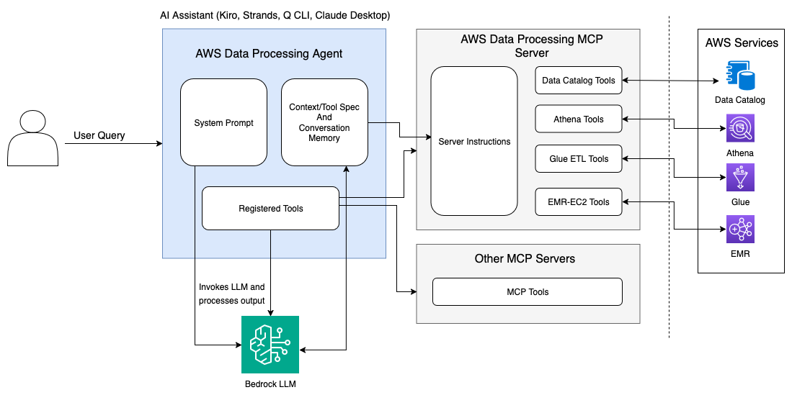

# Amazon Data Processing Agent

## Overview

The **Amazon Data Processing Agent** is an intelligent conversational AI assistant that specializes in AWS data processing services. Built on top of the **Model Context Protocol (MCP)**, this agent provides a natural language interface to complex data engineering tasks across AWS Glue, Amazon Athena, and Amazon EMR-EC2.

### Architecture Diagram



### Agent Features

| Feature | Description |
|---------|-------------|
| Agent Structure | Multi-agent architecture with specialized components |
| Custom Tools | send_email, manage_s3_table_buckets, manage_s3_namespaces, manage_s3_tables | 
| MCP Servers | [AWS Data Processing MCP Server](https://pypi.org/project/awslabs.aws-dataprocessing-mcp-server/) |
| Model Provider | Amazon Bedrock (Claude 3.7 Sonnet, Claude 4.0 Sonnet) |
| UI Framework | Streamlit with real-time streaming |

### What We're Building

This agent transforms how data engineers interact with AWS data processing services by:

- **🤖 Natural Language Interface**: Convert complex data processing requirements into executable AWS solutions through conversational AI
- **🔧 Intelligent Tool Integration**: Seamlessly connect to AWS services via the `aws-dataprocessing-mcp-server` for real-time operations
- **📊 End-to-End Data Pipeline Management**: From data discovery and cataloging to ETL job orchestration and big data analytics
- **💡 Expert Guidance**: Provide cost optimization, performance tuning, and best practice recommendations
- **🚀 Rapid Prototyping**: Generate, test, and deploy data processing solutions with minimal manual intervention

### Architecture & MCP Integration

The agent leverages the **Model Context Protocol (MCP)** to connect with the `aws-dataprocessing-mcp-server`, which provides:

```
┌─────────────────────────────────────┐
│     Amazon Data Processing Agent    │
│  (Streamlit UI + Claude LLM)        │
└─────────────┬───────────────────────┘
              │ MCP Protocol
              ▼
┌─────────────────────────────────────┐
│    aws-dataprocessing-mcp-server    │
│  • AWS Glue Operations              │
│  • Amazon Athena Queries            │
│  • Amazon EMR Management            │
│  • S3 Data Operations               │
│  • Cost & Performance Analytics     │
└─────────────────────────────────────┘
              │
              ▼
┌─────────────────────────────────────┐
│         AWS Services                │
│  • AWS Glue (ETL Jobs & Catalog)    │
│  • Amazon Athena (SQL Analytics)    │
│  • Amazon EMR-EC2 (Big Data)        │
│  • Amazon S3 (Data Storage)         │
└─────────────────────────────────────┘
```

### Key Capabilities

#### **AWS Glue Integration**
- **Data Catalog Management**: Create, update, and manage databases, tables, and partitions
- **ETL Job Development**: Generate optimized PySpark scripts using Glue Version 5 (Spark 3.5.1)
- **Crawler Operations**: Automate schema discovery and metadata management
- **Workflow Orchestration**: Design and manage complex ETL workflows with triggers

#### **Amazon Athena Integration**
- **Natural Language to SQL**: Convert business questions into optimized SQL queries
- **Query Optimization**: Analyze and improve query performance
- **Cost Management**: Monitor and optimize query costs
- **Schema Discovery**: Automatically understand table structures and relationships

#### **Amazon EMR-EC2 Integration**
- **Cluster Management**: Create, configure, and manage EMR clusters
- **Big Data Processing**: Handle large-scale data processing workloads
- **Cost Optimization**: Implement spot instances and auto-scaling strategies
- **Performance Tuning**: Optimize cluster configurations for specific workloads

#### **Intelligent Features**
- **Real-time Streaming**: Live responses with tool execution visibility
- **Context Awareness**: Maintains conversation history for complex multi-step operations
- **Cost Analysis**: Provides detailed cost breakdowns and optimization recommendations
- **Error Handling**: Intelligent retry logic and troubleshooting guidance
- **Best Practices**: Automated recommendations for security, performance, and cost optimization

## Architecture

The project has been refactored into a modular, extensible architecture:

```
src/amazon_dataprocessing_agent/
├── __init__.py                 # Package initialization
├── main.py                     # Main application entry point
├── config/                     # Configuration management
│   ├── __init__.py
│   ├── constants.py           # Constants and styling
│   └── prompts.py             # System prompts
├── core/                      # Core functionality
│   ├── __init__.py
│   ├── agent_manager.py       # MCP agent management
│   ├── bedrock_agent.py       # Bedrock model interface
│   ├── chat_history_manager.py # Chat history management
│   ├── session_state.py       # Session state management
│   └── streaming_handler.py   # Real-time streaming
├── tools/                     # Tool implementations
│   └── __init__.py
└── ui/                        # User interface components
    ├── __init__.py
    └── components.py          # UI rendering
```

## Getting Started

### Prerequisites

- Python >= 3.12
- [uv](https://docs.astral.sh/uv/getting-started/installation/) package manager
- AWS credentials configured

### Installation

1. **Install uv** (if not already installed):
   Follow uv [installation guidelines](https://docs.astral.sh/uv/getting-started/installation/).

2. **Configure AWS credentials** following instructions [here](https://strandsagents.com/latest/user-guide/quickstart/#configuring-credentials).

3. **Install dependencies using uv**:
   ```bash
   uv sync
   ```

4. **Set up environment variables**:
   ```bash
   cp .env.template .env
   # Edit .env with your configuration
   ```

### Running the Application

#### Option 1: Using uv (Recommended)
```bash
# Run the Streamlit application
uv run streamlit run app.py
```

#### Option 2: Using the installed package
```bash
# Install in development mode
uv pip install -e .

# Run the application
uv run dataprocessing-agent
```

#### Option 3: Direct execution
```bash
# Activate the virtual environment and run
uv run python -m streamlit run app.py
```

### Development

#### Project Structure Benefits

- **Modularity**: Each component has a single responsibility
- **Extensibility**: Easy to add new tools, UI components, or core functionality
- **Reusability**: Components can be imported and used independently
- **Maintainability**: Clear separation of concerns makes debugging easier
- **Testability**: Individual components can be unit tested

#### Adding New Features

1. **New Tools**: Add to `src/amazon_dataprocessing_agent/tools/`
2. **UI Components**: Add to `src/amazon_dataprocessing_agent/ui/`
3. **Core Logic**: Add to `src/amazon_dataprocessing_agent/core/`
4. **Configuration**: Add to `src/amazon_dataprocessing_agent/config/`

## Usage

### Getting Started

1. **Launch the application** using one of the methods above
2. **Initialize the agent** using the sidebar controls (connects to aws-dataprocessing-mcp-server)
3. **Select your preferred Claude model** (Claude-3.7 Sonnet or Claude-4 Sonnet)
4. **Start chatting** with the agent about your data processing needs

### Example Conversations

#### **Data Catalog Management**
```
User: "Look at all the tables from my account federated across Glue Data Catalog"
Agent: Goes over glue databases and tables and provide summary of different databases, tables and it schema
```

#### **ETL Job Development**
```
User: "Help me create a Glue job to transform JSON data from S3 to Parquet format"
Agent: Generates optimized PySpark script, uploads to S3, creates Glue job with best practices
```

#### **Natural Language to SQL**
```
User: "Show me the top 10 customers by revenue for the month of July"
Agent: Converts to SQL, executes via Athena, provides results with cost analysis
```

#### **EMR Cluster Management**
```
User: "Identify EMR clusters which are sitting idle and can be terminated"
Agent: Recommends optimal cluster configuration, creates cluster, provides cost estimates
```

### Core Capabilities

#### **AWS Glue Operations**
- **Data Catalog Management**: Create, update, and manage databases, tables, and partitions
- **ETL Job Development**: Generate optimized PySpark scripts using Glue Version 5 (Spark 3.5.1)
- **Crawler Operations**: Automate schema discovery and metadata management
- **Workflow Orchestration**: Design and manage complex ETL workflows with triggers
- **Cost Optimization**: Right-size DPU allocation and implement job bookmarks

#### **Amazon Athena Operations**
- **Natural Language to SQL**: Convert business questions into optimized SQL queries
- **Query Optimization**: Analyze and improve query performance
- **Cost Management**: Monitor and optimize query costs with partitioning strategies
- **Schema Discovery**: Automatically understand table structures and relationships
- **Result Analysis**: Provide insights and visualizations from query results

#### **Amazon EMR-EC2 Operations**
- **Cluster Management**: Create, configure, and manage EMR clusters
- **Big Data Processing**: Handle large-scale data processing workloads (>10TB)
- **Cost Optimization**: Implement spot instances and auto-scaling strategies
- **Performance Tuning**: Optimize cluster configurations for specific workloads
- **Step Management**: Execute and monitor Spark/Hadoop jobs

#### **S3 Data Operations**
- **Bucket Management**: List, analyze, and manage S3 buckets for data processing
- **Script Deployment**: Upload generated scripts to S3 for Glue job execution
- **Usage Analysis**: Identify idle buckets and optimize storage costs
- **Data Format Optimization**: Recommend optimal formats (Parquet, ORC) for analytics

### MCP Server Integration

The agent connects to the `aws-dataprocessing-mcp-server` which provides:

- **Real-time AWS API Integration**: Direct connection to AWS services
- **Asynchronous Operation Monitoring**: Track job status and completion
- **Error Handling & Retries**: Intelligent error recovery and user guidance
- **Cost Tracking**: Real-time cost analysis and optimization recommendations
- **Security Best Practices**: Automated security configuration and compliance checks

## Features

- **Real-time streaming responses** for immediate feedback
- **Context-aware conversations** with sliding window memory
- **Usage statistics tracking** for cost monitoring
- **Export/import chat history** for session management
- **Responsive UI** with modern styling
- **Error handling and retry logic** for robust operation

## Requirements

- Python >= 3.12
- Strands Agents
- Valid AWS credentials
- Access to Amazon Bedrock Claude Athropic models

## Troubleshooting

- Ensure AWS credentials are properly configured
- Verify network connectivity to AWS services
- Check the Streamlit logs for detailed error messages

## Clean up Resources

The Amazon Data Processing Agent creates various AWS resources during operation, including:

- **AWS Glue**: Databases, tables, crawlers, ETL jobs, and workflows
- **Amazon Athena**: Query results stored in S3, workgroups, and data catalogs
- **Amazon EMR**: EC2 clusters, security groups, and associated storage
- **Amazon S3**: Buckets, objects, and lifecycle policies

### Resource Cleanup Options

#### Option 1: Agent-Assisted Cleanup
Ask the agent to help clean up resources:
```
"Please help me clean up all the AWS resources we created today"
```

#### Option 2: Manual Cleanup
Manually clean up resources through the AWS Console or CLI