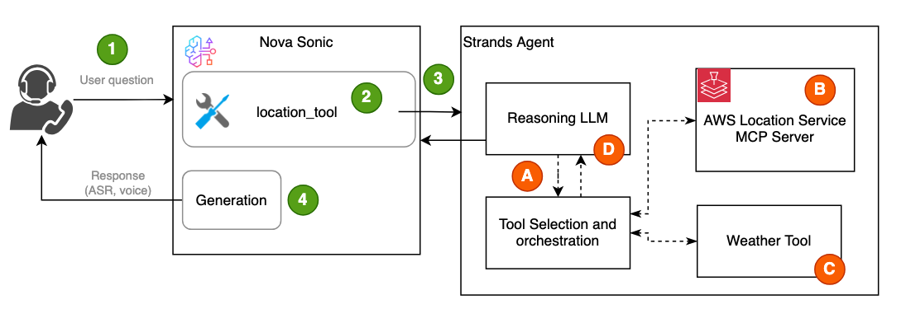

# Nova Sonic integration with Strands 

The [Amazon Nova Sonic model](https://aws.amazon.com/ai/generative-ai/nova/speech/) provides real-time, conversational interactions through bidirectional audio streaming, enabling natural, human-like conversational experiences.

Agentic workflow integration extends Nova Sonic's capabilities by incorporating external context. In this example, we demonstrate how to integrate Sonic with the Strands library, using an agentic workflow outside of Nova Sonic to manage tool selection, reasoning, and generation.

## Integration Architecture 

Amazon Nova Sonic relies on ToolUse to integrate withxw agentic workflows, such as Strands Agents. During Nova Sonic's event lifecycle, you can provide ToolUse configurations through the [`PromptStart` event](https://docs.aws.amazon.com/nova/latest/userguide/input-events.html), which is designed to trigger when Sonic receives specific types of input.

For example, in the Strands Agents sample, we’ve configured ToolUse to trigger an event when the user input relates to the weather in a specific location—such as “How’s the weather in Seattle today?”

``` JSON
{
    "toolSpec": {
        "name": "externalAgent",
        "description": "Get weather information for specific locations.",
        "inputSchema": {
            "json": JSON.stringify({
                "type": "object",
                "properties": {
                    "query": {
                    "type": "string",
                    "description": "The search query to find relevant information"
                    }
                },
                "required": ["query"]
                }
            )
        }
    }
}
```
The diagram below illustrates how Nova Sonic’s built-in reasoning model invokes Strands Agents through a ToolUse trigger.



1 - Users ask questions via voice chat, such as: "What’s the weather like in Seattle today?"

2 - Nova Sonic uses a relatively generic ToolUse definition and returns the ToolName via the ToolUse event.

3 - Nova Sonic app calls the Strands Agents by passing the input, such as 'weather in Seattle' without breaking it down into specific tools.

4 - Nova Sonic processes the Agent response using the prior context and generates output in both text (ARS) and audio formats, streaming them back to the user's device.

A - The Strands Agents take the input 'weather in Seattle' and applies reasoning using an LLM to determine the necessary orchestration:

    - Call the Location Service to retrieve the latitude and longitude for 'Seattle'
    - Call the Weather Tool to get weather information using the retrieved coordinates.

B - Invoke the AWS Location Service MCP server’s search_places tool to retrieve the latitude and longitude for the location name 'Seattle'.

C - Invoke the Weather Tool to retrieve the current weather using latitude and longitude.

D - Generate a text response using the LLM reasoning model based on the information returned by the tools.

## Deploy the sample code
You can follow [this instruction](https://github.com/aws-samples/amazon-nova-samples/tree/main/speech-to-speech/workshops) to deploy the Nova Sonic Workshop sample code, which includes the required components for Nova Sonic along with a module for [Strands integration](https://github.com/aws-samples/amazon-nova-samples/blob/main/speech-to-speech/workshops/python-server/integration/strands_agent.py). Then, refer to the [Strands section](https://github.com/aws-samples/amazon-nova-samples/tree/main/speech-to-speech/workshops#strands-agent-integration) to launch the Strands agent and test the workflow via voice chat.

For detailed instructions, please refer to the [Nova Sonic Workshop Strands Agent Lab](https://catalog.workshops.aws/amazon-nova-sonic-s2s/en-US/02-repeatable-pattern/03-strands).