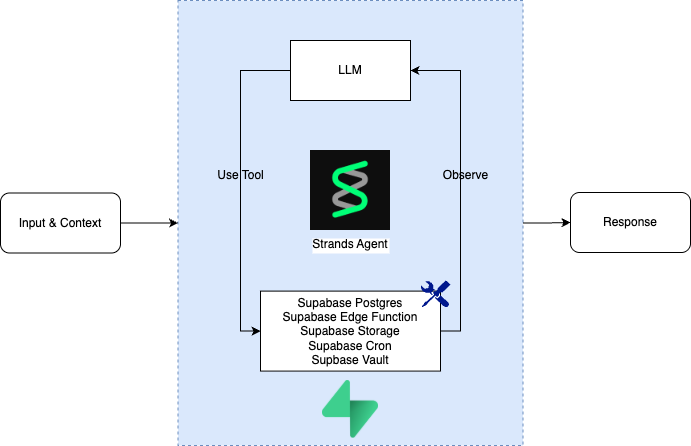
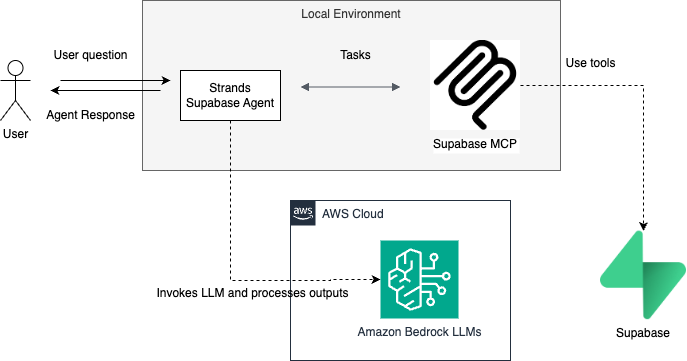

# Strands Agent with Supabase Integration

## Overview

[Supabase](https://supabase.com/) is an open-source Firebase alternative providing all the backend services you need to build a product: a PostgreSQL database, authentication, instant APIs, edge functions, realtime subscriptions, and storage. This integration demonstrates how to use Supabase with Strands AI agents through the Model Context Protocol (MCP).

## Supabase MCP Features

| Feature Group | Available Tools |
|---------------|----------------|
| Account | `list_projects`, `get_project`, `create_project`, `pause_project`, `restore_project`, `list_organizations`, `get_organization`, `get_cost`, `confirm_cost` |
| Knowledge Base | `search_docs` |
| Database | `list_tables`, `list_extensions`, `list_migrations`, `apply_migration`, `execute_sql` |
| Debug | `get_logs`, `get_advisors` |
| Development | `get_project_url`, `get_anon_key`, `generate_typescript_types` |
| Edge Functions | `list_edge_functions`, `deploy_edge_function` |
| Branching (Experimental) | `create_branch`, `list_branches`, `delete_branch`, `merge_branch`, `reset_branch`, `rebase_branch` |
| Storage | `list_storage_buckets`, `get_storage_config`, `update_storage_config` |




                                  


## Example Conversations

### Database Management
```
User: "List all tables in my Supabase strandsai project and explain what each one is used for."
Agent: Analyzes your database schema and provides detailed explanations of each table's purpose and structure
```

```
User: "Create a new table called 'hello_world' with id, message, and created_at columns"
Agent: Creates the table with proper data types and constraints, including auto-incrementing ID and timestamp defaults
```

```
User: "Insert some sample messages into the hello_world table and then retrieve them"
Agent: Inserts multiple sample records and queries them back with formatted results showing timestamps
```

### Edge Function Management
```
User: "List all edge functions in my Supabase project"
Agent: Shows all deployed edge functions with their status and configuration details
```

```
User: "Create a new edge function called 'hello-world' that returns a JSON response with message and timestamp"
Agent: Generates the TypeScript code, deploys the function, and provides the endpoint URL for testing
```

### Storage Operations
```
User: "List all storage buckets in my project and create a new public bucket called 'images'"
Agent: Shows existing buckets and creates a new public bucket with appropriate permissions for image storage
```

### Complete Application Development
```
User: "Build me a complete RSS content curator system with database tables, edge functions, and automated email summaries"
Agent: Creates a full-featured system including:
- Database schema for RSS sources and articles
- RSS fetcher edge function with XML parsing
- Email summary function using Resend API
- Automated cron jobs for hourly fetching and daily emails
- Proper error handling and duplicate prevention
```

## Getting Started

Run the notebook [`supabase-integration.ipynb`](./supabase-integration.ipynb) to explore the Supabase MCP features.