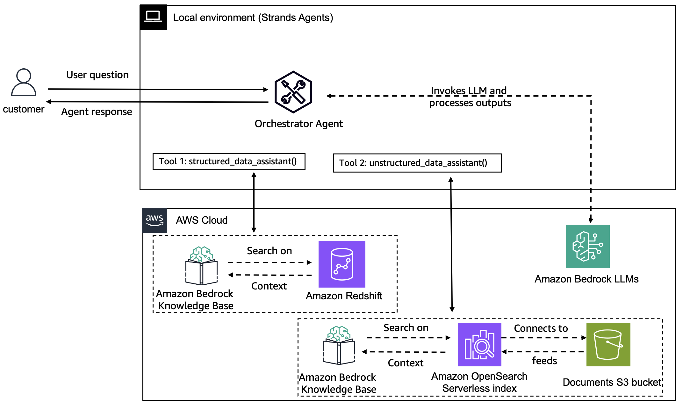

# Unstructured-Structured RAG Agent

This project demonstrates how to build an intelligent RAG system that can route queries between **structured** and **unstructured** knowledge bases using **Strands Agents.**

## Overview

The system consists of:
- **Unstructured Knowledge Base**: Handles document-based, narrative, and conceptual queries
- **Structured Knowledge Base**: Manages data analysis, metrics, and quantitative queries using Redshift
- **Intelligent Routing Agent**: Uses Strands Agent to automatically route queries to the appropriate knowledge base

## Architecture



|Feature             |Description                                        |
|--------------------|---------------------------------------------------|
|Agent Structure     |Single intelligent routing agent                          |
|Unstrcutured Knowledge Base        |Amazon Bedrock Knowledge Base with OpenSearch Serverless                          |
|Structured Knowledge Base       |Amazon Bedrock Knowledge Base connected to Amazon Redshift                  |
|Custom Tools       |structured_data_assistant, unstructured_data_assitant|
|Model Provider      |Amazon Bedrock                                     |


## Project Structure

```
2-unstructure-structured-rag_agent/
├── 0-prerequisites-structured-kb.ipynb                # Setup structured KB
├── 1-prerequisites-unstructured-kb.ipynb              # Setup unstructured KB 
├── 2-unstructured-structured-rag-agent.ipynb          # Main RAG Agent implementation
├── utils/
│   ├── structured_knowledge_base.py                   # Utility for structured Bedrock KB
│   └── knowledge_base.py                              # Utility for unstructured Bedrock KB
├── sample_structured_data/                            
│   ├── orders.csv                        
│   ├── order_items.csv                    
│   ├── payments.csv                    
│   └── reviews.csv                      
└── sample_unstructured_data/
    └── octank_financial_10K.pdf            
```

### Step-by-Step Setup

#### 1. Structured Knowledge Base Setup (`0-prerequisites-structured-kb.ipynb.ipynb`)

This notebook creates:
- **Redshift Serverless**: Namespace and workgroup for structured data
- **S3 Bucket**: For data staging
- **Database Tables**: Orders, order_items, payments, reviews
- **IAM Roles**: For service permissions
- **Structured Bedrock Knowledge Base**: Configured with Redshift as data source

#### 2. Unstructured Knowledge Base Setup (`1-prerequisites-unstructured-kb.ipynb`)

This notebook creates:
- **S3 Bucket**: For document storage
- **Document Upload**: Octank Financial 10K PDF
- **OpenSearch Serverless**: Vector store for embeddings
- **Unstructured Bedrock Knowledge Base**: Configured with document data source

#### 3. Agent Implementation (`2-unstructured-structured-rag-agent.ipynb`)

This notebook demonstrates:
- **Tool Creation**: Separate tools for structured and unstructured knowledge base retrievals
- **Agent Configuration**: Using Strands Agents for intelligent routing

